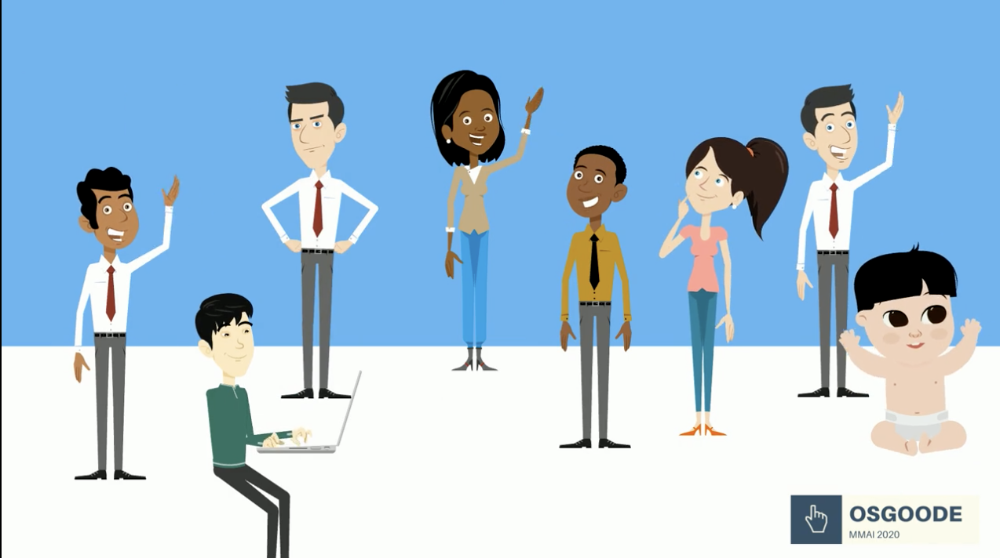

# NLP_Read_Before_You_Agree

 
 
 ## Objective:

This project outlines the concept of a third-party extension or service (henceforth known as the Read Before You Agree, or ‘RBYA’) connected to conventional browsers (such as Google Chrome) to be used in tandem with a consumer signing up for any online-based product or service with an associated ToS agreement. In addition, the RBYA may also be available as a web or app service where consumers can paste their ToS agreements which will help identify punitive and digital privacy clauses that warrant their attention according to user’s preferences, and potentially provide friendlier alternative services.

## Scope: 

RBYA transformed ToS agreement to an ethic vector in 17 categories by using NLP techniques, then compared with user’s ethic vector using cosine similarity so that RBYA can provide recommendations on whether to use the app or which app to use based on user’s comfortable level.

 ## Training and Testing Data:

ToS, DR: Click ==> [Terms of Service](https://tosdr.org/)

The reason using ToS, DR is they provide not only the punitive labels for the sentences in large companies’ ToS, but also provides topic classification for each sentence. Both punitive and category labels are available from this website.Potential other data sources:
IBM Watson – NLP platform provides keyword searching which can give category for each sentence, but fail to flag the punitive clauses.Pribot.org – Website provide classifications and the purposes for ToS, where punitive purposes can be extracted. However there is no straight forward punitive flag can be used for coding as well.
  
 ## Methodology:
 
The user's ethic vector was produced by training two models separately. For each model, RoBERT which is an optimized method for pretraining self-supervised NLP systems was used. "simpletransformers" was the library used in python. Before training the model, the data were preprocessed and prepared to train Model-1 and Model-2. Model-1 was a binary classifier and trained to identify whether the input text is good or bad. While Model-2 was trained to multiclassifier. Then, the parameters of both models were saved using pickles. The output of both models were combined and produced a single vector.  
 

 ## Results
 ## Conclusion
 
To reach a better performance for the trained model, more data needs to be collected. Giving the limited companies’ terms ToS, DR has provided, it is not enough for building a robust model. To proceed, either waiting for more terms being labeled from the same data source, or reaching to a different platform.

Should a platform or APP being developed in order to combine the ToS vectorand user’s vector, where the user can customize their comfortable level and preferences through a well-designed survey. In the current phase, both the user’s survey and the transformation logic for the user’s vector are still in prototype.

The ultimate platform should be able to do the followings:

  1.Have an inventory of as many companies’ ToS as possible  
  2.Have an input access for user to copy/paste the ToS they want to check  
  3.Well-designed survey which can reflects user’s punitive comfort zone/preferences/ 
 4.A logic to transform the survey result to a customized user vector  
 5.Our current model for vectorizing the given ToS 
6.Our current mathematic logic to compare ToS’s vector and user’s vector and give related recommendations
